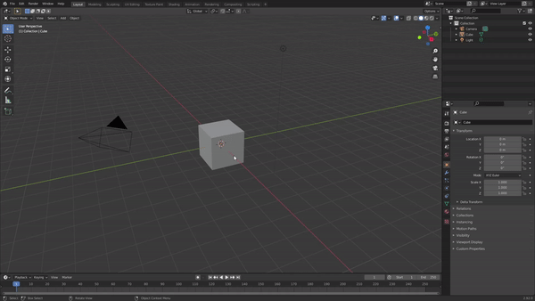

# Getting Started

## Installation and Loading the PBR Painter Workspace

<iframe width="560" height="315" src="https://www.youtube.com/embed/5AvdFg7Jrm4?si=VAaaq2_fsWJiGtka" title="YouTube video player" frameborder="0" allow="accelerometer; autoplay; clipboard-write; encrypted-media; gyroscope; picture-in-picture; web-share" referrerpolicy="strict-origin-when-cross-origin" allowfullscreen></iframe>

When you purchase PBR Painter, you will have access to the .zip file that contains the entire addon package. 

This can be installed in Blender using the normal approach:

## Updating to New Versions

If you already have an old version of PBR Painter installed, and wish to update to a new version, please follow the following steps:

<li> 1. Completely uninstall the old version from Blender. </li>
<li> 2. Install the new version as per normal. </li>
<li> 3. Close and restart Blender to ensure any cached files are cleared. </li>

## Addon Preferences

<iframe width="560" height="315" src="https://www.youtube.com/embed/H_rOdtkc1Yo?si=Ulj7oOo2bJ6C9rjq" title="YouTube video player" frameborder="0" allow="accelerometer; autoplay; clipboard-write; encrypted-media; gyroscope; picture-in-picture; web-share" referrerpolicy="strict-origin-when-cross-origin" allowfullscreen></iframe>

If you are using Blender 3, it is recommended that you choose an asset directory, within the addon preferences. This will create a new filepath to tell Blender where
you're PBR Painter assets will be stored.